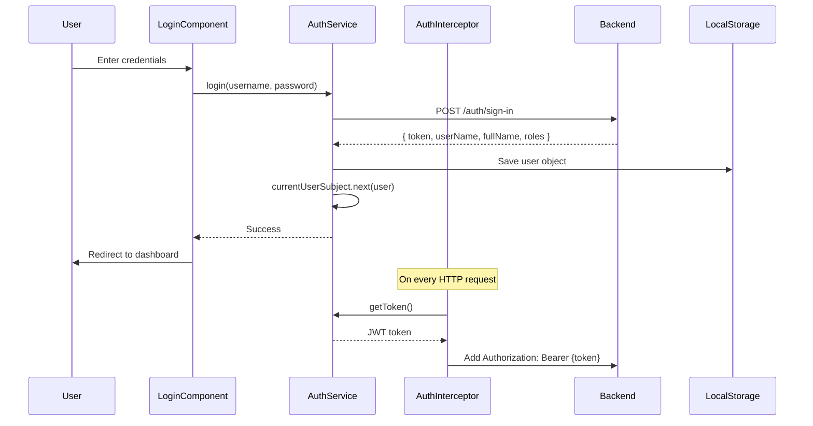

# Frontend Architecture Analysis - EAC Work Permit System

## Project Overview

**Framework:** Angular 17 (Standalone Components)  
**Language:** TypeScript 5.4  
**Styling:** Tailwind CSS 3.4  
**i18n:** ngx-translate (Arabic default)  
**API Base:** `https://localhost:5000/api/v1`

---

## 📁 Project Structure

```
eac/
├── src/
│   ├── app/
│   │   ├── components/          # 15 Feature Components
│   │   ├── services/           # 8 Shared Services
│   │   ├── models/             # 7 TypeScript Interfaces
│   │   ├── guards/             # 1 Route Guard
│   │   ├── interceptors/       # 3 HTTP Interceptors
│   │   ├── app.component.*     # Root Component
│   │   ├── app.config.ts       # Application Configuration
│   │   └── app.routes.ts       # Route Definitions
│   ├── assets/
│   │   └── i18n/               # Translation Files
│   ├── environments/
│   │   └── environment.ts      # Environment Config
│   └── styles.css              # Global Styles
├── angular.json                # Angular CLI Config
├── tailwind.config.js          # Tailwind Configuration
└── package.json                # Dependencies
```

---

## 🎯 Application Architecture

### **Architecture Pattern:** Feature-Based Modular Structure

Angular 17 uses **standalone components** eliminating NgModules. The app is organized by features rather than technical layers.

---

## 🔐 Authentication Flow



**Key Files:**
- [`auth.service.ts`](file:///c:/Users/user/Desktop/Project/app/eac/src/app/services/auth.service.ts) - Authentication logic
- [`auth.interceptor.ts`](file:///c:/Users/user/Desktop/Project/app/eac/src/app/interceptors/auth.interceptor.ts) - JWT injection
- [`auth.guard.ts`](file:///c:/Users/user/Desktop/Project/app/eac/src/app/guards/auth.guard.ts) - Route protection

---

## 🛣️ Routing Structure

### Route Configuration
**File:** [`app.routes.ts`](file:///c:/Users/user/Desktop/Project/app/eac/src/app/app.routes.ts)

| Route | Component | Auth Required | Description |
|-------|-----------|---------------|-------------|
| `/` | - | No | Redirect to `/login` |
| `/login` | LoginComponent | No | User authentication |
| `/dashboard` | DashboardComponent | ✅ Yes | Main dashboard with child tabs |
| `↳ /dashboard/overview` | OverviewTabComponent | ✅ Yes | Overview statistics |
| `↳ /dashboard/analytics` | AnalyticsTabComponent | ✅ Yes | Analytics charts |
| `↳ /dashboard/compliance` | ComplianceTabComponent | ✅ Yes | Compliance metrics |
| `↳ /dashboard/calendar` | CalendarTabComponent | ✅ Yes | Calendar view |
| `/work-permits` | MainWorkPermitsComponent | ✅ Yes | Work permits list |
| `/work-permit/new` | WorkPermitComponent | ✅ Yes | Create new permit |
| `/work-permit/:id/edit` | WorkPermitComponent | ✅ Yes | Edit existing permit |
| `/work-permit/:id/view` | WorkPermitDetailComponent | ✅ Yes | View permit details |
| `/users` | UserManagementComponent | ✅ Yes | User management (lazy loaded) |

### Lazy Loading Strategy
- `UserManagementComponent` is lazy loaded using `loadComponent()`
- Reduces initial bundle size
- Loads component only when route is accessed

---

## 🧩 Components Breakdown

### **1. Authentication Components**

#### LoginComponent
**Purpose:** User login interface  
**Location:** `components/login/`  
**Features:**
- Username/password form
- JWT token retrieval
- Redirect after successful login

#### RegisterComponent (Commented Out)
**Status:** Not currently in use  
**Location:** `components/register/`

---

### **2. Dashboard Components**

#### DashboardComponent (Parent)
**Location:** `components/dashboard/`  
**Type:** Container component with child routes  
**Children:**
- OverviewTabComponent
- AnalyticsTabComponent
- ComplianceTabComponent
- CalendarTabComponent

**Responsibility:** Tab navigation and child route rendering

---

### **3. Work Permit Components**

#### MainWorkPermitsComponent
**Purpose:** List all work permits with filtering  
**Location:** `components/main-work-permits/`  
**Features:**
- Paginated list
- Department filter
- Status filter
- Date range filter
- Export to Word functionality

#### WorkPermitComponent
**Purpose:** Create/Edit work permit form  
**Location:** `components/work-permit/`  
**Modes:**
- Create: `/work-permit/new`
- Edit: `/work-permit/:id/edit`

**Features:**
- Multi-section form
- Worker management (up to 6)
- Security requirements (up to 8)
- Work location tagging

#### WorkPermitDetailComponent
**Purpose:** View single work permit  
**Location:** `components/work-permit-detail/`  
**Features:**
- Read-only view
- Status badge
- Signature display
- Export to Word button
- **Future:** Sign button for admins

---

### **4. Supporting Components**

#### SidebarComponent
**Location:** `components/sidebar/`  
**Purpose:** Navigation menu

#### LoadingSpinnerComponent
**Location:** `components/loading-spinner/`  
**Purpose:** Loading indicator

#### ToastComponent
**Location:** `components/toast/`  
**Purpose:** Notification system

#### ProfileComponent
**Location:** `components/profile/`  
**Purpose:** User profile management  
**Future:** Signature pad integration

#### UserManagementComponent
**Location:** `components/user-management/`  
**Purpose:** Admin user CRUD operations

---

## 🔌 Services Layer

### **1. AuthService**
**File:** [`auth.service.ts`](file:///c:/Users/user/Desktop/Project/app/eac/src/app/services/auth.service.ts)

```typescript
export class AuthService {
  private currentUserSubject = new BehaviorSubject<User | null>(null);
  public currentUser$ = this.currentUserSubject.asObservable();
  
  login(username: string, password: string): Observable<boolean>
  logout(): void
  isLoggedIn(): boolean
  getCurrentUser(): User | null
  getToken(): string | null
}
```

**Patterns:**
- ✅ BehaviorSubject for reactive state management
- ✅ LocalStorage for session persistence
- ✅ Observable pattern for authentication state

---

### **2. WorkPermitService**
**File:** [`work-permit.service.ts`](file:///c:/Users/user/Desktop/Project/app/eac/src/app/services/work-permit.service.ts)

```typescript
export class WorkPermitService {
  // Paginated list with filters
  getAllWorkPermits(filters?: WorkPermitFilters): Observable<PaginatedResult<WorkPermitListDto>>
  
  // CRUD operations
  getWorkPermitById(id: number): Observable<WorkPermitDetailDto>
  createWorkPermit(permitData: WorkPermit): Observable<any>
  updateWorkPermit(permitData: any): Observable<any>
  deletePermitById(id: string): Observable<any>
  
  // Status management
  updateWorkPermitStatus(workPermitId: number, statusId: number): Observable<any>
  getWorkPermitStatuses(): Observable<WorkPermitStatusDto[]>
  
  // Export
  exportWorkPermitToWord(id: number): Observable<Blob>
}
```

**Key Features:**
- Supports pagination via `HttpParams`
- Blob response type for Word document download
- Filters: department, status, date range

---

### **3. UserService**
**File:** [`user.service.ts`](file:///c:/Users/user/Desktop/Project/app/eac/src/app/services/user.service.ts)

**Purpose:** User management operations  
**Future:** Add `updateSignature()` method

---

### **4. DashboardService**
**File:** [`dashboard.service.ts`](file:///c:/Users/user/Desktop/Project/app/eac/src/app/services/dashboard.service.ts)

**Purpose:** Dashboard statistics and metrics

---

### **5. DepartmentService**
**File:** [`department.service.ts`](file:///c:/Users/user/Desktop/Project/app/eac/src/app/services/department.service.ts)

**Purpose:** Department lookup data

---

### **6. ToastService**
**File:** [`toast.service.ts`](file:///c:/Users/user/Desktop/Project/app/eac/src/app/services/toast.service.ts)

**Purpose:** Notification management

---

### **7. MsanService**
**File:** [`msan.service.ts`](file:///c:/Users/user/Desktop/Project/app/eac/src/app/services/msan.service.ts)

**Purpose:** MSAN specific operations

---

### **8. DashboardDataService**
**File:** [`dashboard-data.service.ts`](file:///c:/Users/user/Desktop/Project/app/eac/src/app/services/dashboard-data.service.ts)

**Purpose:** Dashboard data aggregation

---

## 🔒 Security Layer

### **HTTP Interceptors**

#### 1. AuthInterceptor
**File:** [`auth.interceptor.ts`](file:///c:/Users/user/Desktop/Project/app/eac/src/app/interceptors/auth.interceptor.ts)

```typescript
export const authInterceptor: HttpInterceptorFn = (req, next) => {
  const token = authService.getToken();
  if (token) {
    const clonedRequest = req.clone({
      setHeaders: { Authorization: `Bearer ${token}` }
    });
    return next(clonedRequest);
  }
  return next(req);
};
```

**Purpose:** Automatically inject JWT token in all HTTP requests

---

#### 2. ErrorInterceptor
**File:** [`error.interceptor.ts`](file:///c:/Users/user/Desktop/Project/app/eac/src/app/interceptors/error.interceptor.ts)

**Purpose:** Global error handling (status codes, API errors)

---

### **Route Guards**

#### AuthGuard
**File:** [`auth.guard.ts`](file:///c:/Users/user/Desktop/Project/app/eac/src/app/guards/auth.guard.ts)

```typescript
export class AuthGuard implements CanActivate {
  canActivate() {
    if (this.authService.isLoggedIn()) {
      return true;
    }
    return this.router.createUrlTree(['/login']);
  }
}
```

**Purpose:** Protect routes from unauthenticated access

**Future Enhancement:** Add role-based guards (AdminGuard)

---

## 📦 Data Models

### **User Model**
**File:** [`user.ts`](file:///c:/Users/user/Desktop/Project/app/eac/src/app/models/user.ts)

```typescript
export interface User {
  id: number;
  userName: string;
  fullName: string;
  token: string;
  roles: string[];
  // Future: signature?: string;
  // Future: signatureUpdatedAt?: Date;
}
```

---

### **WorkPermit Models**

#### WorkPermitListDto
**File:** [`work-permit-list.ts`](file:///c:/Users/user/Desktop/Project/app/eac/src/app/models/work-permit-list.ts)

**Purpose:** Paginated list item (lightweight)

#### WorkPermitDetailDto
**File:** [`work-permit-detail.ts`](file:///c:/Users/user/Desktop/Project/app/eac/src/app/models/work-permit-detail.ts)

**Purpose:** Full permit details with all fields

**Future Fields to Add:**
```typescript
occupationalSafetyRepresentativeId?: number;
occupationalSafetyRepresentativeName?: string;
occupationalSafetyRepresentativeSignature?: string;
isSigned: boolean;
```

#### WorkPermit
**File:** [`work-permit.ts`](file:///c:/Users/user/Desktop/Project/app/eac/src/app/models/work-permit.ts)

**Purpose:** Create/Update DTO

---

### **Other Models**

- **api-error.ts** - Error response structure
- **dashboard-models.ts** - Dashboard statistics types
- **msan.ts** - MSAN specific types

---

## ⚙️ Configuration

### **Environment Configuration**
**File:** [`environment.ts`](file:///c:/Users/user/Desktop/Project/app/eac/src/environments/environment.ts)

```typescript
export const environment = {
  production: true,
  apiUrl: 'https://localhost:5000/api/v1'
};
```

**Note:** Currently pointing to localhost (should be prod URL in production)

---

### **App Configuration**
**File:** [`app.config.ts`](file:///c:/Users/user/Desktop/Project/app/eac/src/app/app.config.ts)

```typescript
export const appConfig: ApplicationConfig = {
  providers: [
    provideRouter(routes),
    provideHttpClient(withInterceptors([
      authInterceptor,
      errorInterceptor
    ])),
    provideTranslateService({
      defaultLanguage: 'ar'  // Arabic default
    })
  ]
};
```

**Features:**
- Functional interceptors (Angular 17 pattern)
- i18n with Arabic as default
- Standalone component setup

---

## 🎨 Styling Architecture

### **Tailwind CSS**
**Config:** `tailwind.config.js`

**Global Styles:** `src/styles.css`

**Pattern:** Utility-first CSS with Tailwind classes

---

## 🌍 Internationalization (i18n)

### **ngx-translate**
- Default language: **Arabic** (`ar`)
- Translation files: `assets/i18n/*.json`
- HTTP loader for translations

---

## 📊 State Management Pattern

### **Current Pattern:** Service-based State

**Example (AuthService):**
```typescript
private currentUserSubject = new BehaviorSubject<User | null>(null);
public currentUser$ = this.currentUserSubject.asObservable();
```

**Advantages:**
- ✅ Simple and straightforward
- ✅ Reactive with observables
- ✅ No external library needed

**Alternatives Considered:** NgRx, Akita (not used - overkill for current scale)

---

## 🔄 Data Flow Architecture

```
┌─────────────────┐
│   Component     │
│   (Presenter)   │
└────────┬────────┘
         │
         ↓ subscribe
┌─────────────────┐
│    Service      │
│  (Data Source)  │
└────────┬────────┘
         │
         ↓ HTTP
┌─────────────────┐
│   Interceptor   │
│  (Add JWT)      │
└────────┬────────┘
         │
         ↓
┌─────────────────┐
│   Backend API   │
└─────────────────┘
```

---

## 📝 Naming Conventions

### **Files:**
- Components: `component-name.component.ts`
- Services: `service-name.service.ts`
- Models: `model-name.ts`
- Guards: `guard-name.guard.ts`

### **TypeScript:**
- Classes: `PascalCase`
- Interfaces: `PascalCase`
- Variables: `camelCase`
- Constants: `UPPER_SNAKE_CASE`

---

## 🚀 Build & Development

### **Scripts** (package.json)
```json
{
  "start": "ng serve",              // Dev server
  "build": "ng build",              // Production build
  "watch": "ng build --watch",      // Watch mode
  "test": "ng test"                 // Unit tests
}
```

### **Angular CLI Configuration** (angular.json)
- Output path: `dist/`
- Index: `index.html`
- Styles: `styles.css` + Tailwind
- Scripts: None

---

## 🔧 Dependencies Summary

### **Core Dependencies:**
| Package | Version | Purpose |
|---------|---------|---------|
| @angular/core | 17.3.0 | Angular framework |
| @angular/router | 17.3.0 | Routing |
| @angular/forms | 17.3.0 | Reactive/Template forms |
| @ngx-translate | 17.0.0 | i18n |
| rxjs | 7.8.0 | Reactive programming |
| tailwindcss | 3.4.18 | Utility CSS |

---

## 🎯 Architecture Strengths

✅ **Standalone Components** - Modern Angular 17 pattern  
✅ **Lazy Loading** - User management lazy loaded  
✅ **Interceptor Chain** - Auth + Error handling  
✅ **Route Guards** - Authentication protection  
✅ **Reactive Patterns** - Observable-based state  
✅ **Type Safety** - TypeScript interfaces  
✅ **i18n Ready** - Arabic default with ngx-translate  

---

## 🎯 Architecture Recommendations

### **Current State: Good ✅**
The architecture is well-structured for a medium-sized application.

### **Future Enhancements:**

1. **Role-Based Access Control (RBAC)**
   - Add `AdminGuard` for admin-only routes
   - Add `RoleGuard` with role parameter

2. **State Management**
   - Consider NgRx if state complexity grows
   - Current BehaviorSubject pattern is sufficient for now

3. **Error Handling**
   - Expand ErrorInterceptor with retry logic
   - Add global error boundary

4. **Testing**
   - Setup Jasmine/Karma
   - Add unit tests for services
   - Add E2E tests with Cypress/Playwright

5. **Performance**
   - Add more lazy-loaded routes
   - Implement OnPush change detection
   - Add virtual scrolling for large lists

---

## 📋 Frontend Implementation Checklist

For the signature feature, we need to:

### Components:
- [ ] Create `SignaturePadComponent` (reusable)
- [ ] Update `ProfileComponent` (add signature section)
- [ ] Update `WorkPermitDetailComponent` (display signature)
- [ ] Update `MainWorkPermitsComponent` (show signing status)

### Services:
- [ ] Add `updateSignature()` to `UserService`
- [ ] Add `signWorkPermit()` to `WorkPermitService`

### Models:
- [ ] Update `User` interface (add `signature`, `signatureUpdatedAt`)
- [ ] Update `Work PermitDetailDto` (add `isSigned`, `occupationalSafety*` fields)

### Dependencies:
- [ ] Install `signature_pad` library

---

## 🏗️ Overall Assessment

**Architecture Grade:** **A-**

**Strengths:**
- Clean separation of concerns
- Modern Angular practices
- Type safety throughout
- Security-first approach

**Areas for Improvement:**
- Add role-based guards
- Implement comprehensive testing
- Add more documentation comments

---

## 📚 Next Steps

1. Review this architecture document
2. Plan signature feature implementation
3. Create detailed component designs
4. Implement backend integration
5. Add unit tests

---

**Document Created:** 2026-01-26  
**Angular Version:** 17.3  
**Project:** EAC Work Permit System
