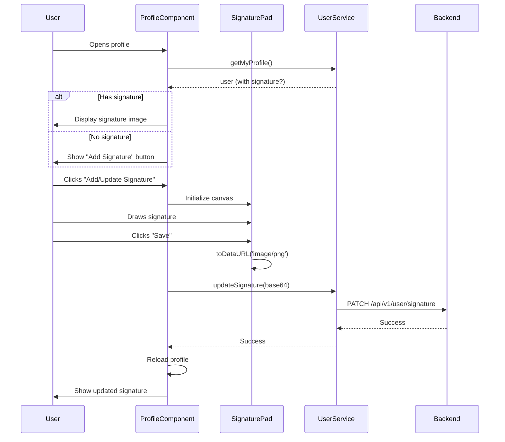

# Profile Component Analysis

## Current Implementation

### Component Overview
**File:** `profile.component.ts`  
**Type:** Modal-based user profile management  
**Styling:** Inline styles + Tailwind CSS

---

## 📋 Current Features

### 1. **Modal Display**
- Fixed overlay with backdrop blur
- Gradient header (indigo to purple)
- Avatar with user initials
- Three modes: View, Edit, Change Password

### 2. **User Profile Fields**
```typescript
interface UserDto {
  userName: string;
  email: string;
  fullName: string;
  nationalId?: string;
  phoneNumber?: string;
  birthDate?: string;
  departmentName: string (read-only);
  roles: string[];
}
```

### 3. **Edit Profile Mode**
- FormGroup with validators
- Editable fields: username, email, fullName, nationalId, phone, birthDate
- Read-only: department, roles
- Save/Cancel buttons

### 4. **Change Password Mode**
- Current password required
- New password (min 6 chars)
- Confirm password with match validation
- Update/Cancel buttons

### 5. **UI/UX Features**
- ✅ Loading spinner
- ✅ Toast notifications
- ✅ Form validation
- ✅ Smooth animations
- ✅ RTL support (Arabic)
- ✅ Responsive design

---

## 🎨 UI Structure

```
┌────────────────────────────────────┐
│   Gradient Header (Purple/Indigo) │
│   [Edit] [ChangePassword]  [Close] │  
└────────────────────────────────────┘
         ╱────────╲
        │  Avatar  │  (User Initial)
        ╲─────────╱
    
    ┌──── Full Name ────┐
    │      (Role)       │
    └───────────────────┘
    
    ┌──────────────────┐
    │ 📧 Email         │
    │ 👤 Username      │
    │ 🏢 Department    │ (Read-only)
    │ 🆔 National ID   │
    │ 📅 Birth Date    │
    │ 📞 Phone         │
    └──────────────────┘
    
    [Save] [Cancel] / [Close]
```

---

## 🔄 Component Flow

### **State Management**
```typescript
isOpen: boolean           // Modal visibility
isEditing: boolean        // Edit mode toggle
isChangingPassword: boolean  // Password mode toggle
loading: boolean          // Loading state
user: UserDto | null      // User data
```

### **Form Groups**
1. **editForm** - Profile fields (reactive forms)
2. **passwordForm** - Password change (with custom validator)

### **API Calls**
```typescript
userService.getMyProfile()          // Load user data
userService.updateMyProfile(data)   // Update profile
userService.changePassword(dto)     // Change password
// MISSING: userService.updateSignature(base64)
```

---

## 🚀 Required Changes for Signature Feature

### **1. Add Signature Field to UserDto Model**
**File:** `app/models/user.ts`

```typescript
export interface UserDto {
  // ... existing fields ...
  signature?: string;              // Base64 image
  signatureUpdatedAt?: Date;
}
```

---

### **2. Add Signature Section to Template**
**Location:** After Phone Number field (line 225)

```html
<!-- Signature Section (NEW) -->
<div class="mt-6 p-4 bg-gradient-to-br from-amber-50 to-orange-50 rounded-xl border-2 border-amber-200">
  <div class="flex items-center justify-between mb-3">
    <h4 class="text-sm font-bold text-amber-900">
      ✍️ التوقيع الرقمي
    </h4>
    @if (user?.signature) {
      <span class="text-xs text-amber-600">
        آخر تحديث: {{ user?.signatureUpdatedAt | date:'yyyy/MM/dd' }}
      </span>
    }
  </div>

  @if (user?.signature) {
    <!-- Display Existing Signature -->
    <div class="bg-white p-3 rounded-lg border border-amber-200 mb-3">
      
    </div>
    <button (click)="openSignaturePad()" 
            class="w-full py-2 bg-amber-600 text-white rounded-lg hover:bg-amber-700 transition-colors text-sm font-semibold">
      تحديث التوقيع
    </button>
  } @else {
    <!-- No Signature -->
    <div class="text-center py-4">
      <p class="text-sm text-amber-700 mb-3">لا يوجد توقيع محفوظ</p>
      <button (click)="openSignaturePad()" 
              class="w-full py-2 bg-amber-600 text-white rounded-lg hover:bg-amber-700 transition-colors text-sm font-semibold">
        إضافة توقيع
      </button>
    </div>
  }
</div>
```

---

### **3. Add Signature Pad Modal**
**Location:** Before closing modal div (line 256)

```html
<!-- Signature Pad Modal (NEW) -->
@if (isSignaturePadOpen) {
  <div class="absolute inset-0 bg-white rounded-3xl z-10 flex flex-col">
    <!-- Header -->
    <div class="p-4 border-b flex items-center justify-between">
      <h3 class="text-lg font-bold text-gray-900">✍️ إضافة التوقيع</h3>
      <button (click)="closeSignaturePad()" 
              class="p-2 hover:bg-gray-100 rounded-lg transition-colors">
        <svg class="h-5 w-5" fill="none" stroke="currentColor" viewBox="0 0 24 24">
          <path stroke-linecap="round" stroke-linejoin="round" stroke-width="2" d="M6 18L18 6M6 6l12 12" />
        </svg>
      </button>
    </div>

    <!-- Signature Canvas -->
    <div class="flex-1 flex flex-col p-4">
      <div class="border-2 border-dashed border-gray-300 rounded-lg bg-gray-50 flex-1 relative">
        <canvas #signatureCanvas 
                class="absolute inset-0 w-full h-full cursor-crosshair">
        </canvas>
      </div>
      
      <!-- Actions -->
      <div class="mt-4 flex gap-2">
        <button (click)="clearSignature()" 
                class="flex-1 py-2 bg-gray-100 text-gray-700 rounded-lg hover:bg-gray-200 transition-colors font-semibold">
          مسح
        </button>
        <button (click)="saveSignature()" 
                [disabled]="isSignatureEmpty"
                class="flex-1 py-2 bg-indigo-600 text-white rounded-lg hover:bg-indigo-700 transition-colors font-semibold disabled:opacity-50">
          حفظ التوقيع
        </button>
      </div>
    </div>
  </div>
}
```

---

### **4. Update Component TypeScript**
**File:** `profile.component.ts`

#### **Add Imports:**
```typescript
import { ViewChild, ElementRef, AfterViewInit } from '@angular/core';
import SignaturePad from 'signature_pad';  // npm package
```

#### **Add Properties:**
```typescript
@ViewChild('signatureCanvas') signatureCanvas!: ElementRef<HTMLCanvasElement>;
signaturePad?: SignaturePad;
isSignaturePadOpen = false;
isSignatureEmpty = true;
```

#### **Add Methods:**
```typescript
openSignaturePad(): void {
  this.isSignaturePadOpen = true;
  this.isEditing = false;
  this.isChangingPassword = false;
  
  // Initialize signature pad after view is ready
  setTimeout(() => {
    this.initSignaturePad();
  }, 100);
}

closeSignaturePad(): void {
  this.isSignaturePadOpen = false;
  if (this.signaturePad) {
    this.signaturePad.clear();
  }
}

initSignaturePad(): void {
  if (!this.signatureCanvas) return;
  
  const canvas = this.signatureCanvas.nativeElement;
  
  // Set canvas size
  canvas.width = canvas.offsetWidth;
  canvas.height = canvas.offsetHeight;
  
  // Initialize SignaturePad
  this.signaturePad = new SignaturePad(canvas, {
    backgroundColor: 'rgb(255, 255, 255)',
    penColor: 'rgb(0, 0, 0)'
  });
  
  // Listen for changes
  this.signaturePad.addEventListener('endStroke', () => {
    this.isSignatureEmpty = this.signaturePad!.isEmpty();
  });
}

clearSignature(): void {
  if (this.signaturePad) {
    this.signaturePad.clear();
    this.isSignatureEmpty = true;
  }
}

saveSignature(): void {
  if (!this.signaturePad || this.signaturePad.isEmpty()) {
    this.toastService.error('الرجاء إضافة التوقيع أولاً');
    return;
  }
  
  // Convert to base64 PNG
  const base64Signature = this.signaturePad.toDataURL('image/png');
  
  this.loading = true;
  this.userService.updateSignature(base64Signature).subscribe({
    next: (res) => {
      this.toastService.success('تم حفظ التوقيع بنجاح');
      this.closeSignaturePad();
      this.loadProfile();  // Reload to show new signature
    },
    error: (err) => {
      this.toastService.error(err.error?.message || 'فشل حفظ التوقيع');
      this.loading = false;
    }
  });
}
```

---

### **5. Update UserService**
**File:** `services/user.service.ts`

```typescript
updateSignature(base64Signature: string): Observable<any> {
  return this.http.patch(`${this.apiUrl}/signature`, {
    signature: base64Signature
  });
}
```

---

### **6. Install Signature Pad Library**

```bash
npm install signature_pad
npm install --save-dev @types/signature_pad
```

---

## 📊 User Flow for Signature



---

## 🎨 Signature Section Design

### **Visual Mockup:**
```
┌──────────────────────────────────────┐
│  ✍️ التوقيع الرقمي                   │
│                 آخر تحديث: 2026/01/26│
├──────────────────────────────────────┤
│ ┌────────────────────────────────┐   │
│ │                                │   │
│ │      [Signature Image]         │   │ 
│ │                                │   │
│ └────────────────────────────────┘   │
│                                      │
│  [تحديث التوقيع]                     │
└──────────────────────────────────────┘
```

### **Colors:**
- Background: Gradient amber-50 to orange-50
- Border: amber-200
- Button: amber-600 (hover: amber-700)
- Text: amber-900

---

## 📦 Dependencies Required

```json
{
  "dependencies": {
    "signature_pad": "^4.1.7"
  },
  "devDependencies": {
    "@types/signature_pad": "^2.3.4"
  }
}
```

---

## ✅ Implementation Checklist

### Frontend - Profile Component:
- [ ] Install signature_pad library
- [ ] Update User model (add signature fields)
- [ ] Add signature section to template
- [ ] Add signature pad modal
- [ ] Implement TypeScript methods
- [ ] Update UserService (add updateSignature)
- [ ] Test signature save/display
- [ ] Test signature update flow

---

## 🔧 Current State Assessment

**Strengths:**
- ✅ Well-structured modal component
- ✅ Clean reactive forms implementation
- ✅ Good UX with loading states
- ✅ Arabic RTL support
- ✅ Responsive design

**Ready for Signature Feature:**
- ✅ Modal architecture supports additional sections
- ✅ Service layer ready for new methods
- ✅ Toast notifications in place
- ✅ Form validation patterns established

**Estimated Implementation Time:** 2-3 hours

---

## 🎯 Next Steps

1. ✅ Review this analysis document
2. ⏳ Install signature_pad library
3. ⏳ Update User model
4. ⏳ Implement signature section in template
5. ⏳ Add TypeScript methods
6. ⏳ Update UserService
7. ⏳ Test end-to-end flow

---

**Document Created:** 2026-01-26  
**Component:** Profile Component  
**Status:** Ready for signature feature implementation
